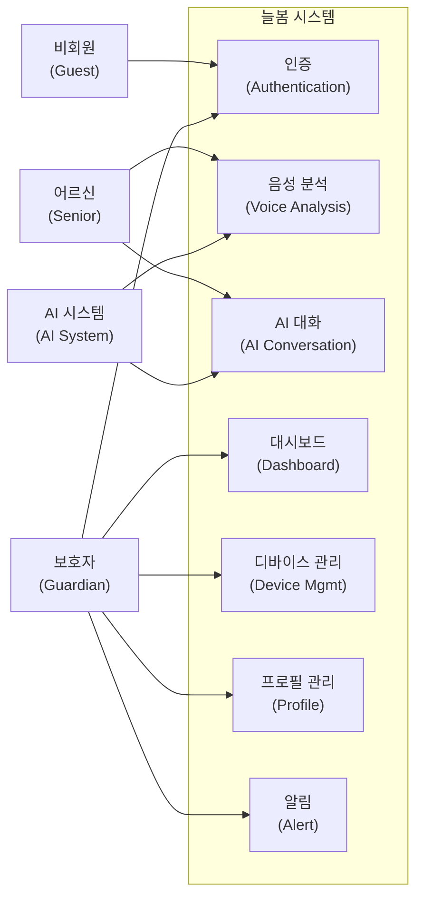
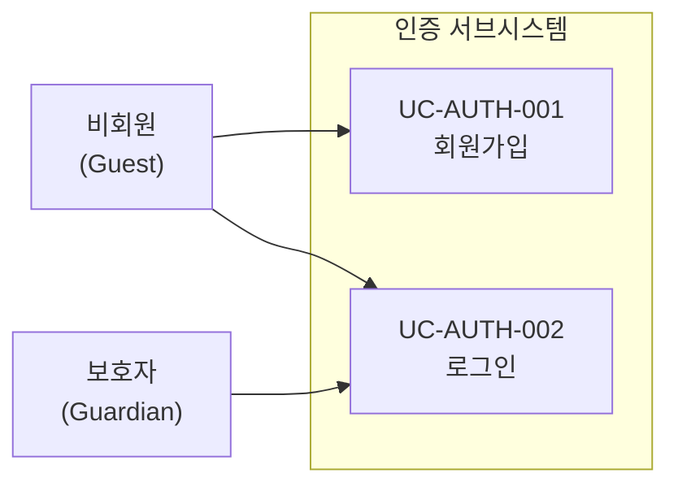
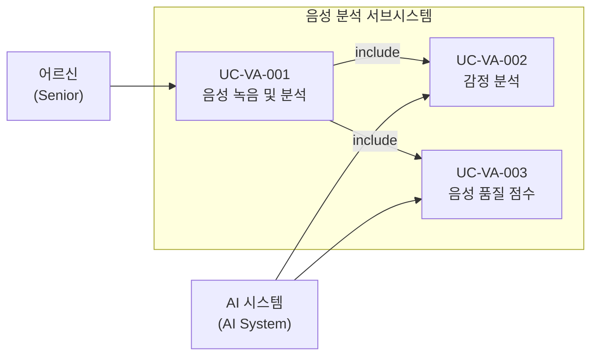
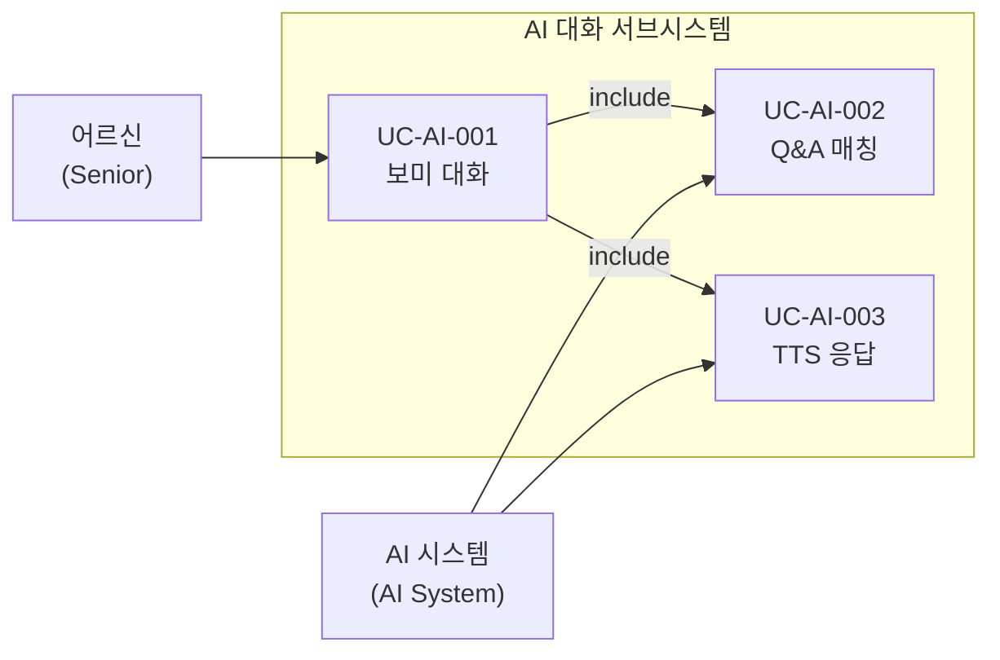
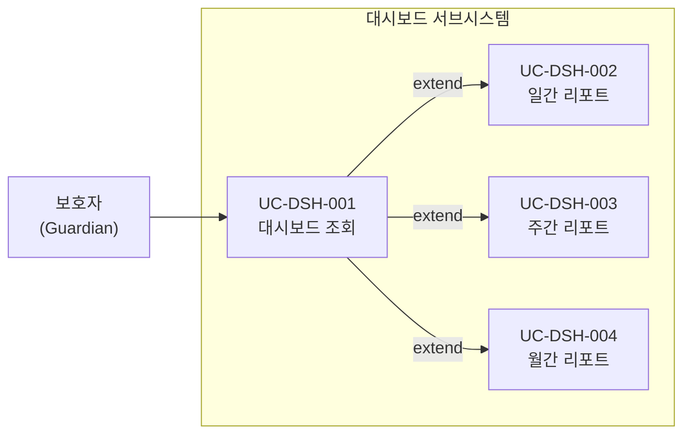
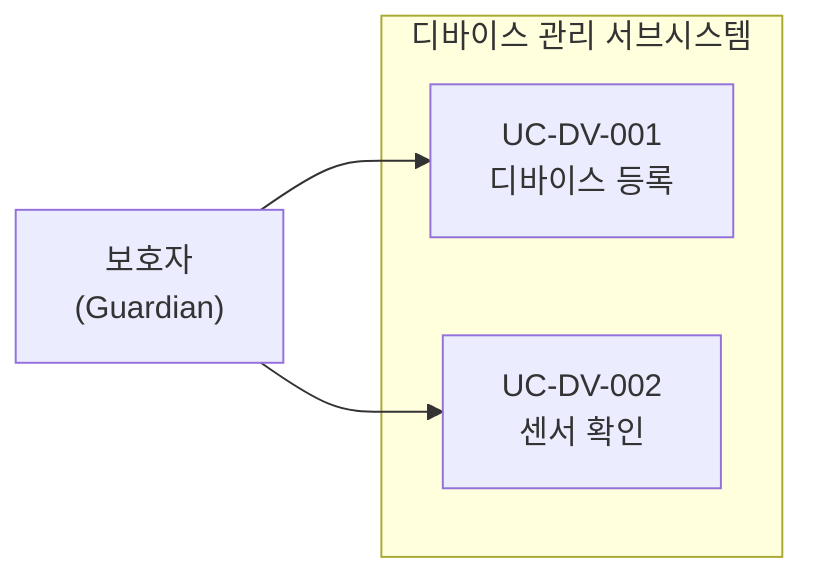
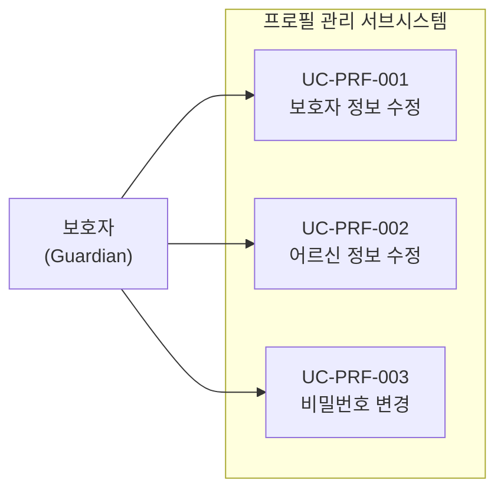
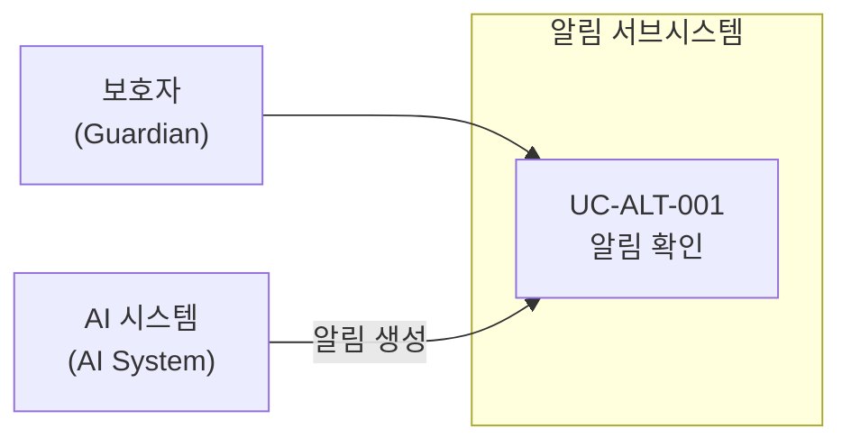

# 늘봄 유스케이스 명세서

## 문서 정보

| 항목 | 내용 |
|------|------|
| 프로젝트명 | 늘봄 (AI 기반 노인 돌봄 음성 분석 시스템) |
| 문서 버전 | 1.0 |
| 작성일 | 2026-02-09 |
| 개발 기간 | 2025년 12월 ~ 2026년 2월 (2025.12.05 ~ 2026.02.10) |
| 개발 인원 | 5명 (최선임 총괄기획, 지태민 프론트엔드, 김승민 백엔드, 최대영 DB/IoT, 조민솔 기획/문서) |

---

## 1. 액터 정의

### 1.1 액터 목록

| 액터 | 영문명 | 유형 | 설명 |
|------|--------|------|------|
| 비회원 | Guest | 기본 액터 | 시스템에 로그인하지 않은 사용자. 회원가입 및 로그인만 가능 |
| 보호자 | Guardian | 주요 액터 | 로그인한 보호자(가족/요양사). 대시보드, 디바이스 관리, 리포트 조회, 프로필 관리 수행 |
| 어르신 | Senior | 주요 액터 | 돌봄 대상 고령자. AI 대화 도우미 '보미'와 음성 대화를 통해 시스템과 상호작용 |
| AI 시스템 | AI System | 시스템 액터 | STT, 감정 분석, LLM 대화 생성, TTS를 수행하는 백엔드 AI 파이프라인 |

### 1.2 액터 계층 구조

```
                    ┌──────────┐
                    │  사용자   │
                    │ (User)   │
                    └────┬─────┘
                         │
            ┌────────────┼────────────┐
            │            │            │
       ┌────▼────┐  ┌───▼────┐  ┌───▼─────┐
       │ 비회원   │  │ 보호자  │  │ 어르신   │
       │ (Guest) │  │(Guard- │  │(Senior) │
       │         │  │ ian)   │  │         │
       └─────────┘  └───┬────┘  └────┬────┘
                        │             │
                        │  상호작용    │  음성 대화
                        ▼             ▼
                   ┌──────────────────────┐
                   │     AI 시스템         │
                   │   (AI System)        │
                   │                      │
                   │  ┌────┐ ┌─────────┐  │
                   │  │STT │ │감정 분석 │  │
                   │  └────┘ └─────────┘  │
                   │  ┌────┐ ┌─────────┐  │
                   │  │TTS │ │LLM 대화 │  │
                   │  └────┘ └─────────┘  │
                   └──────────────────────┘
```

---

## 2. 전체 시스템 유스케이스 다이어그램



---

## 3. 상세 유스케이스 다이어그램

### 3.1 인증 서브시스템



### 3.2 음성 분석 서브시스템



### 3.3 AI 대화 서브시스템



### 3.4 대시보드 서브시스템



### 3.5 디바이스 관리 서브시스템



### 3.6 프로필 관리 서브시스템



### 3.7 알림 서브시스템



---

## 4. 유스케이스 상세 명세

---

### 4.1 인증 (Authentication)

---

#### UC-AUTH-001 회원가입

| 항목 | 내용 |
|------|------|
| 유스케이스 ID | UC-AUTH-001 |
| 유스케이스명 | 회원가입 |
| 액터 | 비회원 (Guest) |
| 사전조건 | 비회원이 회원가입 페이지에 접근한 상태 |

**기본 흐름:**

1. 비회원이 회원가입 페이지에 접근한다.
2. 시스템이 회원가입 폼을 표시한다.
3. 비회원이 보호자 정보를 입력한다 (이름, 이메일, 비밀번호, 비밀번호 확인, 연락처).
4. 비회원이 돌봄 대상 어르신 정보를 입력한다 (이름, 생년월일, 성별).
5. 비회원이 '회원가입' 버튼을 클릭한다.
6. 시스템이 입력값의 유효성을 검증한다.
7. 시스템이 이메일 중복 여부를 확인한다.
8. 시스템이 비밀번호를 암호화하여 보호자 계정을 생성한다.
9. 시스템이 어르신 정보를 등록하고 보호자 계정과 연결한다.
10. 시스템이 회원가입 완료 메시지를 표시하고 로그인 페이지로 이동한다.

**대안 흐름:**

- **3a.** 필수 입력 항목이 누락된 경우, 시스템이 해당 필드에 오류 메시지를 표시한다.
- **6a.** 비밀번호와 비밀번호 확인이 일치하지 않을 경우, 시스템이 "비밀번호가 일치하지 않습니다" 메시지를 표시한다.
- **6b.** 비밀번호가 최소 요구사항(길이, 복잡도)을 충족하지 않을 경우, 시스템이 비밀번호 정책 안내 메시지를 표시한다.
- **7a.** 이미 등록된 이메일인 경우, 시스템이 "이미 사용 중인 이메일입니다" 메시지를 표시한다.

**사후조건:**

- 보호자 계정이 데이터베이스에 생성된다.
- 어르신 정보가 보호자 계정에 연결되어 등록된다.

---

#### UC-AUTH-002 로그인

| 항목 | 내용 |
|------|------|
| 유스케이스 ID | UC-AUTH-002 |
| 유스케이스명 | 로그인 |
| 액터 | 비회원 (Guest), 보호자 (Guardian) |
| 사전조건 | 사용자가 로그인 페이지에 접근한 상태이며, 이미 회원가입이 완료되어 있음 |

**기본 흐름:**

1. 사용자가 로그인 페이지에 접근한다.
2. 시스템이 로그인 폼을 표시한다.
3. 사용자가 이메일과 비밀번호를 입력한다.
4. 사용자가 '로그인' 버튼을 클릭한다.
5. 시스템이 이메일로 계정을 조회한다.
6. 시스템이 입력된 비밀번호와 저장된 암호화 비밀번호를 비교 검증한다.
7. 시스템이 세션을 생성하고 인증 토큰을 발급한다.
8. 시스템이 보호자 대시보드 메인 페이지로 이동한다.

**대안 흐름:**

- **5a.** 존재하지 않는 이메일인 경우, 시스템이 "이메일 또는 비밀번호가 올바르지 않습니다" 메시지를 표시한다.
- **6a.** 비밀번호가 일치하지 않는 경우, 시스템이 "이메일 또는 비밀번호가 올바르지 않습니다" 메시지를 표시한다.
- **3a.** 사용자가 '회원가입' 링크를 클릭하면 UC-AUTH-001로 이동한다.

**사후조건:**

- 사용자 세션이 생성되고 인증된 상태로 전환된다.
- 보호자 대시보드에 접근 가능한 상태가 된다.

---

### 4.2 음성 분석 (Voice Analysis)

---

#### UC-VA-001 음성 녹음 및 분석

| 항목 | 내용 |
|------|------|
| 유스케이스 ID | UC-VA-001 |
| 유스케이스명 | 음성 녹음 및 분석 |
| 액터 | 어르신 (Senior), AI 시스템 (AI System) |
| 사전조건 | 어르신의 디바이스가 등록되어 있고 정상 동작 중인 상태 |

**기본 흐름:**

1. 어르신이 음성 대화 세션을 시작한다 (보미에게 말을 건다).
2. 디바이스가 어르신의 음성을 녹음한다.
3. 시스템이 녹음된 음성 파일(.m4a/.wav)을 서버에 전송한다.
4. AI 시스템이 faster-whisper STT 엔진으로 음성을 텍스트로 변환한다.
5. AI 시스템이 변환된 텍스트와 오디오 신호를 기반으로 UC-VA-002 감정 분석을 수행한다.
6. AI 시스템이 음성 데이터를 기반으로 UC-VA-003 음성 품질 점수를 산출한다.
7. 시스템이 분석 결과(텍스트, 감정, 점수)를 데이터베이스에 저장한다.
8. 시스템이 분석 결과를 보호자 대시보드에 반영한다.

**대안 흐름:**

- **2a.** 주변 소음이 과도하여 음성이 인식되지 않는 경우, 시스템이 재시도를 요청한다.
- **4a.** STT 변환에 실패한 경우, 시스템이 오류를 로깅하고 "음성을 인식하지 못했습니다" 메시지를 반환한다.
- **3a.** 네트워크 연결이 불안정한 경우, 디바이스가 음성 파일을 로컬에 임시 저장하고 연결 복구 후 재전송한다.

**사후조건:**

- 어르신의 음성이 텍스트로 변환되어 저장된다.
- 감정 분석 결과와 음성 품질 점수가 데이터베이스에 기록된다.
- 보호자 대시보드의 분석 데이터가 갱신된다.

---

#### UC-VA-002 감정 분석

| 항목 | 내용 |
|------|------|
| 유스케이스 ID | UC-VA-002 |
| 유스케이스명 | 감정 분석 |
| 액터 | AI 시스템 (AI System) |
| 사전조건 | UC-VA-001에서 음성-텍스트 변환이 완료된 상태 |

**기본 흐름:**

1. AI 시스템이 변환된 텍스트를 HuggingFace 텍스트 감정 분석 모델에 입력한다.
2. AI 시스템이 오디오 신호를 HuggingFace 오디오 감정 분석 모델에 입력한다.
3. AI 시스템이 텍스트 기반 감정 결과와 오디오 기반 감정 결과를 앙상블하여 최종 감정을 판별한다.
4. AI 시스템이 감정 카테고리(기쁨, 슬픔, 분노, 불안, 중립 등)와 신뢰도 점수를 산출한다.
5. 시스템이 감정 분석 결과를 데이터베이스에 저장한다.
6. 감정 상태가 부정적(슬픔, 분노, 불안)이고 신뢰도가 임계값을 초과하면, 시스템이 보호자에게 알림을 생성한다.

**대안 흐름:**

- **1a.** 텍스트가 너무 짧아 감정 분석이 불가능한 경우, 오디오 기반 감정 분석 결과만 사용한다.
- **2a.** 오디오 품질이 낮아 분석이 어려운 경우, 텍스트 기반 감정 분석 결과만 사용한다.
- **3a.** 텍스트와 오디오 감정 결과가 상충하는 경우, 가중 평균 방식으로 최종 감정을 결정한다.

**사후조건:**

- 감정 카테고리와 신뢰도 점수가 데이터베이스에 저장된다.
- 부정적 감정 감지 시 보호자 알림이 생성된다.

---

#### UC-VA-003 음성 품질 점수

| 항목 | 내용 |
|------|------|
| 유스케이스 ID | UC-VA-003 |
| 유스케이스명 | 음성 품질 점수 |
| 액터 | AI 시스템 (AI System) |
| 사전조건 | UC-VA-001에서 음성 녹음 및 STT 변환이 완료된 상태 |

**기본 흐름:**

1. AI 시스템이 오디오 신호에서 librosa를 사용하여 피치(pitch) 정보를 추출한다.
2. AI 시스템이 VPR(Voice Pitch Ratio, 음성 피치 비율)을 계산하여 활력 지표를 산출한다.
3. AI 시스템이 변환된 텍스트에서 TTR(Type-Token Ratio, 어휘 다양성 비율)을 계산한다.
4. AI 시스템이 발화 속도, 발화 길이, 침묵 구간 비율 등 추가 지표를 분석한다.
5. AI 시스템이 8차원 음성 분석 점수를 종합적으로 산출한다.
6. 시스템이 음성 품질 점수를 데이터베이스에 저장한다.
7. 시스템이 이전 기록과 비교하여 변화 추이를 계산한다.

**대안 흐름:**

- **1a.** 오디오 길이가 분석 최소 기준 미달인 경우, 시스템이 "분석 가능한 최소 음성 길이가 부족합니다" 결과를 반환한다.
- **5a.** 특정 차원의 점수 산출이 불가능한 경우, 해당 차원은 "측정 불가"로 표시하고 나머지 차원만 산출한다.

**사후조건:**

- 8차원 음성 품질 점수가 데이터베이스에 저장된다.
- 보호자 대시보드 리포트에 점수 추이가 반영된다.

---

### 4.3 AI 대화 (AI Conversation)

---

#### UC-AI-001 보미 대화

| 항목 | 내용 |
|------|------|
| 유스케이스 ID | UC-AI-001 |
| 유스케이스명 | 보미 대화 |
| 액터 | 어르신 (Senior), AI 시스템 (AI System) |
| 사전조건 | 어르신의 디바이스가 정상 동작 중이며, 음성 세션이 활성화된 상태 |

**기본 흐름:**

1. 어르신이 보미에게 음성으로 말을 건다.
2. 시스템이 음성을 녹음하여 서버에 전송한다.
3. AI 시스템이 STT를 통해 음성을 텍스트로 변환한다.
4. AI 시스템이 UC-AI-002 Q&A 매칭을 수행하여 기존 Q&A 데이터셋에서 적합한 응답을 탐색한다.
5. AI 시스템이 LLM(GPT-4o-mini)에 대화 컨텍스트와 어르신 정보를 포함한 프롬프트를 전달한다.
6. LLM이 어르신에게 적합한 따뜻하고 친근한 톤의 응답 텍스트를 생성한다.
7. AI 시스템이 UC-AI-003 TTS 응답을 수행하여 응답 텍스트를 음성으로 변환한다.
8. 시스템이 음성 응답을 디바이스로 전송하여 재생한다.
9. 시스템이 대화 내용(질문/응답)을 데이터베이스에 저장한다.

**대안 흐름:**

- **3a.** 음성 인식에 실패한 경우, 보미가 "다시 한번 말씀해 주시겠어요?" 라고 응답한다.
- **4a.** Q&A 데이터셋에 매칭되는 항목이 없는 경우, LLM이 자유 대화 모드로 응답을 생성한다.
- **5a.** LLM API 호출에 실패한 경우, 시스템이 사전 정의된 기본 응답("잠시 후 다시 이야기해요")을 반환한다.
- **7a.** TTS 변환에 실패한 경우, 텍스트 응답만 디바이스 화면에 표시한다.

**사후조건:**

- 어르신이 보미의 음성 응답을 들을 수 있다.
- 대화 내용이 데이터베이스에 기록되어 보호자가 조회할 수 있다.

---

#### UC-AI-002 Q&A 매칭

| 항목 | 내용 |
|------|------|
| 유스케이스 ID | UC-AI-002 |
| 유스케이스명 | Q&A 매칭 |
| 액터 | AI 시스템 (AI System) |
| 사전조건 | UC-AI-001에서 어르신의 발화가 텍스트로 변환된 상태 |

**기본 흐름:**

1. AI 시스템이 변환된 텍스트에서 키워드 및 의도(intent)를 추출한다.
2. AI 시스템이 사전 구축된 Q&A 데이터셋에서 유사도 기반 매칭을 수행한다.
3. 매칭 신뢰도가 임계값 이상인 경우, 해당 Q&A 응답을 후보로 선정한다.
4. AI 시스템이 Q&A 매칭 결과를 LLM 프롬프트의 참고 컨텍스트로 전달한다.

**대안 흐름:**

- **2a.** 데이터셋에 유사한 질문이 없는 경우, 빈 결과를 반환하고 LLM이 자유 대화로 응답한다.
- **3a.** 매칭 신뢰도가 낮은 경우, 복수의 후보를 LLM에 전달하여 최적 응답을 선택하도록 한다.

**사후조건:**

- Q&A 매칭 결과가 LLM 대화 생성의 참고 자료로 활용된다.
- 매칭 이력이 로그에 기록된다.

---

#### UC-AI-003 TTS 응답

| 항목 | 내용 |
|------|------|
| 유스케이스 ID | UC-AI-003 |
| 유스케이스명 | TTS 응답 |
| 액터 | AI 시스템 (AI System) |
| 사전조건 | UC-AI-001에서 LLM이 응답 텍스트를 생성한 상태 |

**기본 흐름:**

1. AI 시스템이 LLM 응답 텍스트를 수신한다.
2. AI 시스템이 Edge TTS 엔진에 텍스트를 전달한다.
3. Edge TTS가 한국어 음성 모델을 사용하여 텍스트를 자연스러운 음성으로 합성한다.
4. AI 시스템이 생성된 음성 파일을 서버에 저장한다.
5. 시스템이 음성 파일 URL을 클라이언트(디바이스)에 반환한다.
6. 디바이스가 음성 파일을 재생하여 어르신에게 들려준다.

**대안 흐름:**

- **2a.** Edge TTS 서비스가 불가용한 경우, pyttsx3 또는 gTTS를 대안 엔진으로 사용한다.
- **3a.** 응답 텍스트가 TTS 최대 길이를 초과하는 경우, 텍스트를 분할하여 순차적으로 합성한다.

**사후조건:**

- 어르신이 보미의 음성 응답을 청취할 수 있다.
- 음성 파일이 서버에 저장되어 이후 재생이 가능하다.

---

### 4.4 대시보드 (Dashboard)

---

#### UC-DSH-001 대시보드 조회

| 항목 | 내용 |
|------|------|
| 유스케이스 ID | UC-DSH-001 |
| 유스케이스명 | 대시보드 조회 |
| 액터 | 보호자 (Guardian) |
| 사전조건 | 보호자가 로그인된 상태 (UC-AUTH-002 완료) |

**기본 흐름:**

1. 보호자가 대시보드 페이지에 접근한다.
2. 시스템이 보호자에게 연결된 어르신 정보를 조회한다.
3. 시스템이 어르신의 최근 음성 분석 결과 요약을 표시한다.
4. 시스템이 최근 감정 분석 추이를 차트로 표시한다.
5. 시스템이 최근 음성 품질 점수 추이를 차트로 표시한다.
6. 시스템이 최근 대화 기록 목록을 표시한다.
7. 시스템이 미확인 알림 건수를 표시한다.
8. 시스템이 디바이스 연결 상태를 표시한다.

**대안 흐름:**

- **3a.** 아직 분석 데이터가 없는 경우, "아직 수집된 데이터가 없습니다" 안내 메시지를 표시한다.
- **8a.** 디바이스가 미등록 상태인 경우, 디바이스 등록 안내 메시지를 표시한다.

**사후조건:**

- 보호자가 어르신의 최신 건강 상태와 활동 정보를 종합적으로 확인할 수 있다.

---

#### UC-DSH-002 일간 리포트

| 항목 | 내용 |
|------|------|
| 유스케이스 ID | UC-DSH-002 |
| 유스케이스명 | 일간 리포트 |
| 액터 | 보호자 (Guardian) |
| 사전조건 | 보호자가 로그인된 상태이며 대시보드에 접근한 상태 |

**기본 흐름:**

1. 보호자가 대시보드에서 '일간 리포트' 탭을 선택한다.
2. 시스템이 오늘 날짜의 활동 데이터를 데이터베이스에서 조회한다.
3. 시스템이 당일 대화 횟수, 총 대화 시간을 표시한다.
4. 시스템이 당일 감정 분석 결과를 시간대별 차트로 표시한다.
5. 시스템이 당일 음성 품질 점수(8차원)를 레이더 차트로 표시한다.
6. 시스템이 당일 주요 대화 내용 요약을 표시한다.
7. 보호자가 날짜를 변경하여 다른 날의 리포트를 조회할 수 있다.

**대안 흐름:**

- **2a.** 선택한 날짜에 데이터가 없는 경우, "해당 날짜에 기록된 활동이 없습니다" 메시지를 표시한다.
- **7a.** 미래 날짜를 선택한 경우, 시스템이 오늘 날짜까지만 선택 가능하도록 제한한다.

**사후조건:**

- 보호자가 어르신의 일간 활동 상세 내역을 확인할 수 있다.

---

#### UC-DSH-003 주간 리포트

| 항목 | 내용 |
|------|------|
| 유스케이스 ID | UC-DSH-003 |
| 유스케이스명 | 주간 리포트 |
| 액터 | 보호자 (Guardian) |
| 사전조건 | 보호자가 로그인된 상태이며 대시보드에 접근한 상태 |

**기본 흐름:**

1. 보호자가 대시보드에서 '주간 리포트' 탭을 선택한다.
2. 시스템이 최근 7일간의 활동 데이터를 데이터베이스에서 조회한다.
3. 시스템이 일별 대화 횟수 및 대화 시간 추이를 꺾은선 그래프로 표시한다.
4. 시스템이 일별 감정 분포를 막대 그래프로 표시한다.
5. 시스템이 일별 음성 품질 점수 변화 추이를 표시한다.
6. 시스템이 주간 종합 분석 요약(전주 대비 변화, 주요 이벤트)을 텍스트로 표시한다.
7. 보호자가 주(week)를 변경하여 다른 기간의 리포트를 조회할 수 있다.

**대안 흐름:**

- **2a.** 7일 중 데이터가 존재하는 날이 일부인 경우, 존재하는 날의 데이터만 표시하고 빈 날은 "데이터 없음"으로 표기한다.
- **6a.** 전주 데이터가 없어 비교가 불가능한 경우, 비교 분석 항목을 생략한다.

**사후조건:**

- 보호자가 어르신의 주간 활동 추이와 변화를 파악할 수 있다.

---

#### UC-DSH-004 월간 리포트

| 항목 | 내용 |
|------|------|
| 유스케이스 ID | UC-DSH-004 |
| 유스케이스명 | 월간 리포트 |
| 액터 | 보호자 (Guardian) |
| 사전조건 | 보호자가 로그인된 상태이며 대시보드에 접근한 상태 |

**기본 흐름:**

1. 보호자가 대시보드에서 '월간 리포트' 탭을 선택한다.
2. 시스템이 해당 월의 활동 데이터를 데이터베이스에서 조회한다.
3. 시스템이 월간 대화 횟수, 평균 대화 시간, 총 대화 시간을 표시한다.
4. 시스템이 주별 감정 분포 추이를 차트로 표시한다.
5. 시스템이 월간 음성 품질 점수 평균 및 변화 추이를 표시한다.
6. 시스템이 월간 종합 건강 리포트(감정 안정도, 활력 변화, 어휘 다양성 추이)를 생성하여 표시한다.
7. 보호자가 월(month)을 변경하여 다른 기간의 리포트를 조회할 수 있다.

**대안 흐름:**

- **2a.** 해당 월에 데이터가 전혀 없는 경우, "해당 월에 기록된 활동이 없습니다" 메시지를 표시한다.
- **6a.** 데이터가 충분하지 않아 통계적 유의미한 분석이 어려운 경우, "데이터가 충분히 수집되면 상세 분석이 제공됩니다" 메시지를 표시한다.

**사후조건:**

- 보호자가 어르신의 월간 건강 상태 변화와 장기적 추이를 확인할 수 있다.

---

### 4.5 디바이스 관리 (Device Management)

---

#### UC-DV-001 디바이스 등록

| 항목 | 내용 |
|------|------|
| 유스케이스 ID | UC-DV-001 |
| 유스케이스명 | 디바이스 등록 |
| 액터 | 보호자 (Guardian) |
| 사전조건 | 보호자가 로그인된 상태 (UC-AUTH-002 완료) |

**기본 흐름:**

1. 보호자가 디바이스 관리 페이지에 접근한다.
2. 시스템이 현재 등록된 디바이스 목록을 표시한다.
3. 보호자가 '디바이스 추가' 버튼을 클릭한다.
4. 시스템이 디바이스 등록 폼을 표시한다.
5. 보호자가 디바이스 정보를 입력한다 (디바이스 이름, 디바이스 유형, 설치 위치).
6. 보호자가 '등록' 버튼을 클릭한다.
7. 시스템이 입력값을 검증하고 디바이스를 데이터베이스에 등록한다.
8. 시스템이 디바이스를 보호자 계정 및 어르신 정보와 연결한다.
9. 시스템이 등록 완료 메시지를 표시하고 디바이스 목록을 갱신한다.

**대안 흐름:**

- **5a.** 필수 입력 항목이 누락된 경우, 시스템이 해당 필드에 오류 메시지를 표시한다.
- **7a.** 동일한 디바이스가 이미 등록되어 있는 경우, "이미 등록된 디바이스입니다" 메시지를 표시한다.

**사후조건:**

- 새로운 디바이스가 데이터베이스에 등록되고 보호자/어르신 계정에 연결된다.
- 등록된 디바이스에서 음성 수집이 가능한 상태가 된다.

---

#### UC-DV-002 센서 확인

| 항목 | 내용 |
|------|------|
| 유스케이스 ID | UC-DV-002 |
| 유스케이스명 | 센서 확인 |
| 액터 | 보호자 (Guardian) |
| 사전조건 | 보호자가 로그인된 상태이며, 최소 1개 이상의 디바이스가 등록되어 있음 |

**기본 흐름:**

1. 보호자가 디바이스 관리 페이지에 접근한다.
2. 시스템이 등록된 디바이스 목록과 각 디바이스의 상태를 표시한다.
3. 보호자가 특정 디바이스를 선택한다.
4. 시스템이 해당 디바이스의 센서 상세 정보를 조회한다.
5. 시스템이 센서 상태(온라인/오프라인), 마지막 데이터 수신 시간, 배터리 잔량 등을 표시한다.
6. 시스템이 센서 데이터 수집 이력을 표시한다.

**대안 흐름:**

- **4a.** 디바이스가 오프라인 상태인 경우, "디바이스 연결이 끊어진 상태입니다. 마지막 연결: [시간]" 메시지를 표시한다.
- **5a.** 센서 이상이 감지된 경우, 경고 아이콘과 함께 이상 내용을 표시한다.

**사후조건:**

- 보호자가 디바이스 및 센서의 현재 상태를 확인할 수 있다.

---

### 4.6 프로필 관리 (Profile)

---

#### UC-PRF-001 보호자 정보 수정

| 항목 | 내용 |
|------|------|
| 유스케이스 ID | UC-PRF-001 |
| 유스케이스명 | 보호자 정보 수정 |
| 액터 | 보호자 (Guardian) |
| 사전조건 | 보호자가 로그인된 상태 (UC-AUTH-002 완료) |

**기본 흐름:**

1. 보호자가 프로필 관리 페이지에 접근한다.
2. 시스템이 현재 보호자 정보(이름, 이메일, 연락처)를 표시한다.
3. 보호자가 수정할 항목을 변경한다.
4. 보호자가 '저장' 버튼을 클릭한다.
5. 시스템이 입력값의 유효성을 검증한다.
6. 시스템이 변경된 정보를 데이터베이스에 업데이트한다.
7. 시스템이 "정보가 성공적으로 수정되었습니다" 메시지를 표시한다.

**대안 흐름:**

- **5a.** 연락처 형식이 올바르지 않은 경우, 시스템이 "올바른 연락처 형식을 입력해 주세요" 메시지를 표시한다.
- **5b.** 변경된 이메일이 다른 계정에서 사용 중인 경우, 시스템이 "이미 사용 중인 이메일입니다" 메시지를 표시한다.
- **3a.** 보호자가 아무 항목도 변경하지 않고 '저장'을 클릭한 경우, 시스템이 "변경된 내용이 없습니다" 메시지를 표시한다.

**사후조건:**

- 보호자의 수정된 정보가 데이터베이스에 반영된다.

---

#### UC-PRF-002 어르신 정보 수정

| 항목 | 내용 |
|------|------|
| 유스케이스 ID | UC-PRF-002 |
| 유스케이스명 | 어르신 정보 수정 |
| 액터 | 보호자 (Guardian) |
| 사전조건 | 보호자가 로그인된 상태이며, 어르신 정보가 등록되어 있음 |

**기본 흐름:**

1. 보호자가 프로필 관리 페이지에서 '어르신 정보' 섹션에 접근한다.
2. 시스템이 현재 어르신 정보(이름, 생년월일, 성별, 건강 정보)를 표시한다.
3. 보호자가 수정할 항목을 변경한다.
4. 보호자가 '저장' 버튼을 클릭한다.
5. 시스템이 입력값의 유효성을 검증한다.
6. 시스템이 변경된 정보를 데이터베이스에 업데이트한다.
7. 시스템이 "어르신 정보가 성공적으로 수정되었습니다" 메시지를 표시한다.

**대안 흐름:**

- **5a.** 생년월일 형식이 올바르지 않은 경우, 시스템이 "올바른 날짜 형식을 입력해 주세요" 메시지를 표시한다.
- **3a.** 보호자가 아무 항목도 변경하지 않고 '저장'을 클릭한 경우, 시스템이 "변경된 내용이 없습니다" 메시지를 표시한다.

**사후조건:**

- 어르신의 수정된 정보가 데이터베이스에 반영된다.
- AI 시스템의 대화 컨텍스트에 업데이트된 어르신 정보가 반영된다.

---

#### UC-PRF-003 비밀번호 변경

| 항목 | 내용 |
|------|------|
| 유스케이스 ID | UC-PRF-003 |
| 유스케이스명 | 비밀번호 변경 |
| 액터 | 보호자 (Guardian) |
| 사전조건 | 보호자가 로그인된 상태 (UC-AUTH-002 완료) |

**기본 흐름:**

1. 보호자가 프로필 관리 페이지에서 '비밀번호 변경' 섹션에 접근한다.
2. 시스템이 비밀번호 변경 폼을 표시한다.
3. 보호자가 현재 비밀번호를 입력한다.
4. 보호자가 새 비밀번호와 새 비밀번호 확인을 입력한다.
5. 보호자가 '변경' 버튼을 클릭한다.
6. 시스템이 현재 비밀번호의 일치 여부를 검증한다.
7. 시스템이 새 비밀번호의 유효성(길이, 복잡도)을 검증한다.
8. 시스템이 새 비밀번호를 암호화하여 데이터베이스에 업데이트한다.
9. 시스템이 "비밀번호가 성공적으로 변경되었습니다" 메시지를 표시한다.

**대안 흐름:**

- **6a.** 현재 비밀번호가 일치하지 않는 경우, 시스템이 "현재 비밀번호가 올바르지 않습니다" 메시지를 표시한다.
- **7a.** 새 비밀번호와 확인이 일치하지 않는 경우, 시스템이 "새 비밀번호가 일치하지 않습니다" 메시지를 표시한다.
- **7b.** 새 비밀번호가 현재 비밀번호와 동일한 경우, 시스템이 "현재 비밀번호와 다른 비밀번호를 입력해 주세요" 메시지를 표시한다.
- **7c.** 새 비밀번호가 최소 요구사항을 충족하지 않는 경우, 시스템이 비밀번호 정책 안내 메시지를 표시한다.

**사후조건:**

- 보호자의 비밀번호가 새 비밀번호로 변경된다.
- 다음 로그인 시 새 비밀번호로 인증해야 한다.

---

### 4.7 알림 (Alert)

---

#### UC-ALT-001 알림 확인

| 항목 | 내용 |
|------|------|
| 유스케이스 ID | UC-ALT-001 |
| 유스케이스명 | 알림 확인 |
| 액터 | 보호자 (Guardian), AI 시스템 (AI System) |
| 사전조건 | 보호자가 로그인된 상태이며, AI 시스템에 의해 생성된 알림이 존재함 |

**기본 흐름:**

1. 보호자가 대시보드 또는 알림 페이지에 접근한다.
2. 시스템이 미확인 알림 건수를 알림 아이콘에 배지로 표시한다.
3. 보호자가 알림 아이콘을 클릭한다.
4. 시스템이 알림 목록을 최신순으로 표시한다 (알림 유형, 내용, 발생 시간).
5. 보호자가 특정 알림을 클릭하여 상세 내용을 확인한다.
6. 시스템이 해당 알림의 상세 정보(감정 분석 결과, 관련 대화 내용, 권장 조치)를 표시한다.
7. 시스템이 해당 알림을 '확인됨' 상태로 변경한다.

**대안 흐름:**

- **4a.** 알림이 없는 경우, "현재 알림이 없습니다" 메시지를 표시한다.
- **1a.** 긴급 알림(위험 감정 감지, 장시간 무반응 등)인 경우, 시스템이 팝업 또는 푸시 알림으로 즉시 보호자에게 전달한다.

**알림 생성 조건 (AI 시스템):**

- 부정적 감정(슬픔, 분노, 불안)이 임계값 이상의 신뢰도로 감지된 경우
- 어르신의 일정 시간 이상 무반응(대화 없음)이 감지된 경우
- 음성 품질 점수가 이전 평균 대비 급격히 하락한 경우
- 디바이스 연결이 장시간 끊어진 경우

**사후조건:**

- 보호자가 알림 내용을 확인하고 적절한 조치를 취할 수 있다.
- 확인된 알림은 '확인됨' 상태로 기록된다.

---

## 5. 유스케이스 요약 매트릭스

| 유스케이스 ID | 유스케이스명 | 비회원 | 보호자 | 어르신 | AI 시스템 |
|--------------|-------------|--------|--------|--------|-----------|
| UC-AUTH-001 | 회원가입 | O | - | - | - |
| UC-AUTH-002 | 로그인 | O | O | - | - |
| UC-VA-001 | 음성 녹음 및 분석 | - | - | O | O |
| UC-VA-002 | 감정 분석 | - | - | - | O |
| UC-VA-003 | 음성 품질 점수 | - | - | - | O |
| UC-AI-001 | 보미 대화 | - | - | O | O |
| UC-AI-002 | Q&A 매칭 | - | - | - | O |
| UC-AI-003 | TTS 응답 | - | - | - | O |
| UC-DSH-001 | 대시보드 조회 | - | O | - | - |
| UC-DSH-002 | 일간 리포트 | - | O | - | - |
| UC-DSH-003 | 주간 리포트 | - | O | - | - |
| UC-DSH-004 | 월간 리포트 | - | O | - | - |
| UC-DV-001 | 디바이스 등록 | - | O | - | - |
| UC-DV-002 | 센서 확인 | - | O | - | - |
| UC-PRF-001 | 보호자 정보 수정 | - | O | - | - |
| UC-PRF-002 | 어르신 정보 수정 | - | O | - | - |
| UC-PRF-003 | 비밀번호 변경 | - | O | - | - |
| UC-ALT-001 | 알림 확인 | - | O | - | O |

---

## 6. 문서 이력

| 버전 | 작성일 | 작성자 | 변경 내용 |
|------|--------|--------|----------|
| 1.0 | 2026-02-09 | 늘봄 개발팀 | 최초 작성. 전체 유스케이스 명세 정의 (7개 서브시스템, 18개 유스케이스) |
